# User Query Processing Flow Diagram

## Complete Flow: Frontend → Backend → RAG → Gemini → Response

```mermaid
sequenceDiagram
    autonumber
    participant User
    participant GradioUI as Gradio Frontend<br/>(app.py)
    participant API as FastAPI Backend<br/>(main.py)
    participant RAG as RAG Engine<br/>(rag_engine.py)
    participant ChromaDB as ChromaDB<br/>Vector Store
    participant Embedder as SentenceTransformer<br/>(all-MiniLM-L6-v2)
    participant Gemini as Google Gemini<br/>API

    rect rgb(30, 30, 50)
    Note over User,GradioUI: 🎯 USER INTERACTION
    User->>GradioUI: Types: "What are Q3 revenue numbers?"<br/>Clicks "Send 🚀" (RAG enabled)
    GradioUI->>GradioUI: Validate message<br/>Add to UI history: [(msg, None)]
    end

    rect rgb(40, 30, 60)
    Note over GradioUI,API: 🌐 HTTP REQUEST
    GradioUI->>API: POST /chat<br/>{"message": "What are Q3...",<br/>"session_id": null,<br/>"use_rag": true}
    end

    rect rgb(50, 30, 70)
    Note over API: 📥 BACKEND PROCESSING
    API->>API: Generate/reuse session_id<br/>"f7e8a9b2-1234-..."
    API->>API: Check use_rag flag ✓
    API->>RAG: generate_response(message, session_id)
    end

    rect rgb(20, 50, 70)
    Note over RAG,Gemini: 🔍 RAG RETRIEVAL PHASE
    RAG->>RAG: retrieve_relevant_chunks(query, n=5)
    RAG->>Embedder: encode("What are Q3 revenue numbers?")
    Embedder-->>RAG: [0.23, -0.45, 0.12, ..., 0.89]<br/>(384-dimensional vector)

    RAG->>ChromaDB: query(query_embeddings, n_results=5)
    ChromaDB->>ChromaDB: Cosine similarity search<br/>across all document embeddings
    ChromaDB-->>RAG: Top-5 chunks + metadata<br/>["Q3 revenue reached $2.5M...",<br/>"The quarterly financial...",<br/>...]<br/>Sources: [quarterly_report.pdf, ...]
    end

    rect rgb(70, 40, 30)
    Note over RAG,Gemini: 🤖 GENERATION PHASE
    RAG->>RAG: Get session history (last 10 msgs)
    RAG->>RAG: Build context from 5 chunks<br/>Format prompt with:<br/>- Context from documents<br/>- Previous conversation<br/>- User question

    RAG->>Gemini: generate_content(prompt)
    Note over Gemini: Prompt contains:<br/>• 5 relevant doc chunks<br/>• Conversation history<br/>• User question
    Gemini->>Gemini: Analyze context<br/>Extract Q3 revenue info<br/>Generate response
    Gemini-->>RAG: "Based on uploaded documents,<br/>Q3 revenue reached $2.5M,<br/>up 15% from Q2..."
    end

    rect rgb(50, 60, 40)
    Note over RAG: 💾 SESSION MANAGEMENT
    RAG->>RAG: Update session history:<br/>append({"role": "user", "content": ...})<br/>append({"role": "assistant", "content": ...})<br/>Keep last 10 messages
    RAG->>RAG: Extract unique sources:<br/>["quarterly_report.pdf",<br/>"financial_summary.docx"]
    end

    rect rgb(40, 50, 70)
    Note over RAG,API: 📤 BACKEND RESPONSE
    RAG-->>API: return (response_text, sources)
    API->>API: Create ChatResponse object<br/>{response, session_id, sources}
    API-->>GradioUI: HTTP 200 OK<br/>{"response": "Based on...",<br/>"session_id": "f7e8a9b2...",<br/>"sources": ["quarterly_report.pdf", ...]}
    end

    rect rgb(30, 30, 50)
    Note over GradioUI,User: 🖥️ UI UPDATE
    GradioUI->>GradioUI: Parse JSON response<br/>Store session_id<br/>Append sources to response
    GradioUI->>GradioUI: Update chat history:<br/>history[-1] = (msg, full_response)
    GradioUI->>User: Display response + sources<br/>"Based on uploaded documents...<br/>📚 Sources: quarterly_report.pdf,<br/>financial_summary.docx"
    end

    rect rgb(40, 40, 40)
    Note over User,Gemini: ✅ CONVERSATION COMPLETE - Ready for next query
    end
```

## Alternative Flow: Direct Chat (RAG Disabled)

## Component Architecture Diagram

## Data Flow: Query Processing with RAG

```mermaid
flowchart TD
    A[👤 User Query<br/>'What are Q3 revenue numbers?'] --> B{RAG Enabled?}

    B -->|Yes| C[🔤 Text to Vector<br/>SentenceTransformer<br/>384-dim embedding]
    B -->|No| M[Direct to Gemini]

    C --> D[🔍 ChromaDB Search<br/>Cosine Similarity]

    D --> E[📊 Top-5 Chunks Retrieved<br/>+ Source Metadata]

    E --> F[🧩 Build Context<br/>Concatenate chunks]

    F --> G[📝 Build Prompt<br/>Context + History + Question]

    G --> H[🤖 Gemini API Call<br/>Generate Response]

    H --> I[💾 Update Session History<br/>Store last 10 messages]

    I --> J[📤 Return Response<br/>+ Sources + Session ID]

    M --> H

    J --> K[🖥️ Display in UI<br/>With Source Citations]

    style A fill:#667eea,stroke:#764ba2,color:#fff
    style C fill:#f093fb,stroke:#f5576c,color:#fff
    style D fill:#4facfe,stroke:#00f2fe,color:#fff
    style E fill:#43e97b,stroke:#38f9d7,color:#000
    style H fill:#fa709a,stroke:#fee140,color:#fff
    style K fill:#fccb90,stroke:#d57eeb,color:#000
```

## Session Management Flow

## Vector Search Process Detail

## Complete System Architecture

```mermaid
graph TB
    subgraph "User Layer"
        U[👤 User]
    end

    subgraph "Frontend Layer - localhost:7860"
        UI[Gradio Web Interface]
        VIZ[Visualizations<br/>Three.js + D3.js]
    end

    subgraph "API Layer - localhost:8000"
        API[FastAPI REST API]
        EP1[POST /chat]
        EP2[POST /upload]
        EP3[GET /documents]
        EP4[DELETE /documents]
    end

    subgraph "Processing Layer"
        DP[Document Processor<br/>PDF, DOCX, XLSX, etc.]
        RE[RAG Engine]
        CHUNK[Text Chunker<br/>1000 chars, 200 overlap]
    end

    subgraph "AI Layer"
        EMB[SentenceTransformer<br/>Embedding Model]
        GEM[Gemini API<br/>LLM]
    end

    subgraph "Storage Layer"
        VDB[(ChromaDB<br/>Vector Database)]
        FS[(File System<br/>uploads/)]
        SESS[(Session History<br/>In-Memory Dict)]
    end

    U <-->|HTTP| UI
    UI --> VIZ
    UI <-->|REST API| API
    API --> EP1
    API --> EP2
    API --> EP3
    API --> EP4

    EP2 --> DP
    DP --> CHUNK
    CHUNK --> EMB
    EMB --> VDB
    DP --> FS

    EP1 --> RE
    RE --> EMB
    RE --> VDB
    RE --> SESS
    RE --> GEM

    EP3 --> VDB
    EP4 --> VDB

    style U fill:#4a5568,stroke:#cbd5e0,color:#fff
    style UI fill:#667eea,stroke:#764ba2,color:#fff
    style API fill:#f093fb,stroke:#f5576c,color:#fff
    style RE fill:#4facfe,stroke:#00f2fe,color:#fff
    style VDB fill:#43e97b,stroke:#38f9d7,color:#000
    style GEM fill:#fa709a,stroke:#fee140,color:#fff
    style EMB fill:#fccb90,stroke:#d57eeb,color:#000
```

---

## Key Metrics & Performance Characteristics

| Stage | Component | Time | Details |
|-------|-----------|------|---------|
| 1 | User Input → Frontend | ~10ms | Gradio event handling |
| 2 | HTTP Request | ~5ms | localhost network |
| 3 | Query Encoding | ~50ms | SentenceTransformer inference |
| 4 | Vector Search | ~20ms | ChromaDB cosine similarity (HNSW) |
| 5 | Prompt Building | ~5ms | String concatenation |
| 6 | Gemini API | ~1-3s | External API call (variable) |
| 7 | Response Processing | ~10ms | JSON serialization |
| 8 | UI Update | ~50ms | Gradio rendering |
| **Total** | **End-to-End** | **~1.2-3.2s** | Mostly Gemini API latency |

---

## Error Handling Flow

