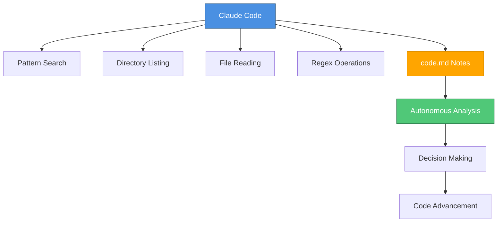

# 1. Introduction to Claude Code

## What is Claude Code?

Claude Code is an **agentic coding assistant** that can work autonomously on coding tasks for extended periods. It represents a major advancement in AI-assisted coding, capable of:

- Working on tasks for many minutes independently
- Managing complex, multi-step coding operations
- Operating on entire codebases systematically
- Running multiple parallel instances on different parts of a codebase

## Why Claude Code Matters

> "Claude Code's my personal favorite coding assistant right now, and it has boosted my and many other developers' productivity by a large margin." - Andrew Ng

Key benefits:

- **High productivity gains** for developers
- **Deep toolset** with many advanced features
- **Autonomous operation** requiring minimal supervision
- **Scalable approach** supporting parallel workflows

---

## Evolution of AI-Assisted Coding

### Progression Timeline

1. **Early Stage:** Developers asking LLMs occasional coding questions
2. **Autocomplete Era:** GitHub and similar autocomplete suggestions
3. **Growing Autonomy:** Tools becoming more autonomous
4. **Claude Code Release:** Significant step up in agency and autonomy
5. **Current State:** Multiple Claude instances working in parallel

---

## Core Best Practices

### 1. Provide Clear Context

**Why it matters:** Clear context helps Claude Code achieve tasks efficiently

**Key strategies:**

- Point Claude Code to relevant files
- Clearly describe features and functionality
- Properly extend capabilities with MCP servers and tools

### 2. Master the Tool Ecosystem

Effective Claude Code usage requires understanding:

- **Git worktrees** for parallel development
- **MCP (Model Context Protocol) servers** for extended capabilities
- **Planning and thinking modes** for complex tasks
- **Memory management** for context retention

### 3. Coordinate Multiple Instances

Advanced developers orchestrate several Claude instances:

- Work on different parts of codebase simultaneously
- Coordinate efforts across parallel sessions
- Manage context and handoffs between instances

---

## Course Projects

### Project 1: RAG Chatbot

**Full-stack implementation** covering:

#### Frontend Development

- User interface implementation
- Interactive chat components

#### Backend Development

- RAG (Retrieval-Augmented Generation) implementation
- API endpoint creation

#### Code Quality

- **Refactoring** existing code
- **Writing tests** for reliability
- **GitHub integration** for PR management
- **Issue resolution** workflows

#### Claude Code Features Used

- Planning modes
- Thinking modes
- Parallel sessions
- Memory management

---

### Project 2: E-commerce Data Analysis

**Jupyter notebook workflows** including:

#### Data Exploration

- Working with e-commerce datasets
- Data analysis and visualization

#### Refactoring

- Cleaning up notebook code
- Removing redundant code
- Improving code organization

#### Dashboard Creation

- Building interactive dashboards
- Creating web applications for data visualization

---

### Project 3: Figma to Frontend

**Visual design implementation** workflow:

#### Design Import

- Using Figma MCP server
- Importing design mockups

#### Agentic Development

- Iterative design refinement
- Automated testing
- Frontend application building

#### MCP Integration

- Multiple MCP servers
- Extended tool capabilities

---

## Claude Code Architecture

### Simplified Design Philosophy

Claude Code's effectiveness comes from a **surprisingly simple architecture**:

### Core Tools

Claude Code relies on just a **small number of fundamental tools**:

| Tool | Purpose |
|------|---------|
| **Pattern Search** | Find patterns within code files |
| **Directory Listing** | Navigate codebase structure |
| **File Reading** | Access and understand code |
| **Regex Operations** | Advanced text pattern matching |
| **code.md** | Internal note-taking for context |

### What Claude Code Does NOT Use

❌ **Semantic embedding** of codebases

❌ **Complex indexing systems**

❌ **Transform code into searchable structures**

### The code.md Approach

**Key innovation:** Claude Code uses a file called `code.md` to:

1. **Take notes** while reading through code
2. **Build understanding** of the codebase autonomously
3. **Figure out** what's happening in the code
4. **Drive decision-making** on how to advance development

This approach enables:

- Autonomous codebase exploration
- Context building without pre-indexing
- Informed decision-making about code changes

---

## Security and Privacy

### Local-First Architecture

**Key benefit:** Because Claude Code doesn't require indexing the codebase:

✅ **Codebase stays local**
✅ **Enhanced security**
✅ **Privacy preservation**
✅ **No external data transmission required**

The course will cover security ramifications in detail in later sections.

---

## Key Takeaways

### For Non-Claude Code Users

Learning this course material provides:

- **Meaningful acceleration** in system engineering capabilities
- **New paradigms** for thinking about AI-assisted development
- **Practical skills** transferable to other AI coding tools

### For Current Claude Code Users

Benefits include:

- **Comprehensive best practices** systematically organized
- **New techniques** to try in daily work
- **Deeper understanding** of tool capabilities
- **Productivity improvements** through optimized workflows

---

## Quick Reference

### Essential Concepts

| Concept | Description |
|---------|-------------|
| **Agency** | Claude Code's ability to work autonomously |
| **MCP Servers** | Model Context Protocol servers for extending capabilities |
| **Git Worktrees** | Parallel development branch management |
| **code.md** | Internal note file for context building |
| **Planning Mode** | Strategic task breakdown feature |
| **Thinking Mode** | Deep reasoning for complex problems |

### Key Commands & Features

- Pattern searching in files
- Directory navigation
- Regex pattern matching
- Parallel session creation
- Memory management controls
- GitHub PR integration
