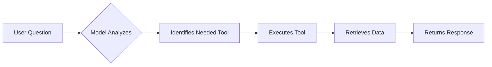
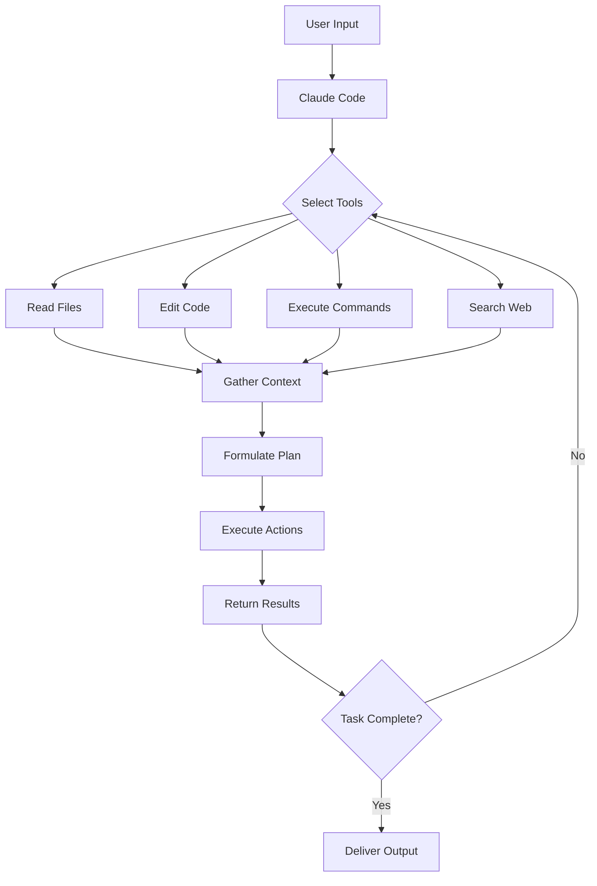

# 2. What is Claude Code?

## What is Claude Code?

### Core Concept

Claude Code is a **lightweight harness** for AI models that enables complex coding tasks through the command line. Rather than just providing input/output interaction, it creates an agentic system with three key components:

```text
┌─────────────────────────────────────┐
│        Agentic System               │
├─────────────────────────────────────┤
│  1. Model (Claude Opus/Sonnet)      │
│  2. Tools (File operations, etc.)   │
│  3. Environment (Command line)      │
└─────────────────────────────────────┘
```

### Why Not Use Models Directly?

Models alone have limitations:

- No inherent knowledge of your codebase
- Cannot navigate file systems
- Unable to handle multi-step tasks effectively

Claude Code solves this by providing infrastructure around the model.

---

## Key Capabilities

### Core Functionality

Claude Code provides three essential pieces of functionality:

1. **Memory**
   - Remembers user preferences
   - Retains context about the codebase
   - Maintains task history

2. **Planning Environment**
   - Determines required data
   - Formulates action plans
   - Executes tasks systematically

3. **Tool Integration**
   - Extends model capabilities
   - Enables real-world actions
   - Provides codebase interaction

### Model Options

| Model | Best For |
|-------|----------|
| **Claude Opus** | Complex tasks requiring deep reasoning |
| **Claude Sonnet** | Everyday coding tasks, balanced performance |

*Model availability depends on your subscription level.*

---

## Primary Use Cases

### 1. Discovery & Exploration (The Most Powerful Feature)

Before writing any code, use Claude Code to:

- **Discover** existing codebases
- **Explain** complex code structures
- **Design** solutions and architectures

> 💡 **Pro Tip**: Get up to speed on a new codebase using Claude Code before making any changes.

### 2. Code Writing & Generation

- Writing new code from scratch
- Implementing features
- Creating assets and deliverables

### 3. Maintenance & Debugging

- Refactoring existing code
- Debugging errors
- Code optimization

### 4. Beyond Coding

- Data analysis
- Creating visualizations
- Generating reports and documentation

### 5. Integration & Automation

- GitHub integration
- CI/CD workflows
- Automated code reviews

---

## Tool Use Architecture

### How Tool Use Works



### Example Flow

**User Request**: "What code is written in this file?"

1. Model receives question
2. Identifies need for file reading capability
3. Uses `read_file` tool
4. Retrieves file contents
5. Returns formatted response

This transforms Claude from a **simple assistant** to an **extremely sophisticated agentic tool**.

---

## Built-in Tools

### File Operations

#### Reading Tools

- `read_file` - Read contents of individual files
- `list_directory` - View directory structure
- `search_files` - Find files matching patterns

#### Editing Tools

- `edit_file` - Modify existing files
- `create_file` - Generate new files
- `delete_file` - Remove files

### Advanced Operations

#### Pattern Finding

- `grep_search` - Search for patterns across files
- `regex_match` - Advanced pattern matching

#### Web Integration

- `web_search` - Search the internet for information
- `web_fetch` - Retrieve web content

#### Execution

- `bash_command` - Execute shell/bash commands
- `run_tests` - Execute test suites

#### Sub-Agents

- `spawn_agent` - Create specialized agents for complex subtasks
- Handle challenging, multi-step operations

---

## Agentic Search: Security-First Architecture

### Why Not Index?

Traditional code assistants create structured representations of entire codebases, which can:

- Require sending code to external servers
- Create security vulnerabilities
- Violate data privacy policies

### Claude Code's Approach

```text
┌──────────────────────────────────────────┐
│     Agentic Search (On-Demand)           │
├──────────────────────────────────────────┤
│  ✓ Code stays local                      │
│  ✓ No full codebase indexing             │
│  ✓ Searches only when needed             │
│  ✓ Uses multiple agents & tools          │
│  ✓ Context-aware exploration             │
└──────────────────────────────────────────┘
```

**Benefits:**

- Enhanced security
- Privacy preservation
- Reduced resource usage
- No code leaves your ecosystem

---

## Memory System

### The `claude.md` File

Claude Code uses a markdown file called `claude.md` for persistent memory.

**What Can You Store?**

- Common configurations
- Style guidelines
- Project conventions
- Preferred patterns
- Team standards

**Location**: Root of your project directory

**Example `claude.md`**:

```markdown
# Project Configuration

## Code Style
- Use 2 spaces for indentation
- Prefer functional components in React
- Use TypeScript for all new files

## Testing Guidelines
- Write tests for all public APIs
- Use Jest for unit tests
- Aim for 80% code coverage

## Naming Conventions
- Components: PascalCase
- Functions: camelCase
- Constants: UPPER_SNAKE_CASE
```

### Conversation Storage

- **Storage**: Conversations stored locally on your machine
- **Persistence**: History maintained across sessions
- **Control**: Can clear context to start fresh
- **Resume**: Can continue previous conversations easily

---

## MCP: Model Context Protocol

### Extensibility Through MCP

While Claude Code comes with built-in tools, you can add more functionality through **MCP servers**.

### What is MCP?

**MCP (Model Context Protocol)** is:

- Open-source
- Model-agnostic
- Enables easy communication between data and AI systems
- Allows data and AI systems to communicate seamlessly

### Benefits

```text
Built-in Tools + MCP Servers = Extended Functionality
```

- Add custom tools for specific workflows
- Integrate with third-party services
- Extend capabilities without modifying core code
- Share tools across teams

---

## Hands-On Demo: Quick Start

### Initial Setup

1. **Open Terminal** in VS Code
2. **Navigate to project folder** (e.g., `cd demo1`)
3. **Launch Claude Code**:

   ```bash
   claude
   ```

4. **Trust folder** (first-time prompt)

### Example Session

**User Prompt**: "Make a cool visualization for me"

**Claude Code's Workflow**:

1. Creates todo list of actions
2. Plans visualization approach
3. Generates HTML/JavaScript/Python files
4. Implements interactive features
5. Opens in browser

**Result**: Interactive particle visualization with:

- Animated particles
- Toggle controls
- Clear functionality
- Expandable features
- Galaxy Visualization

### Visual Studio Code Integration

When using Claude Code within VS Code:

- See real-time file changes
- Accept/reject modifications visually
- Auto-approve for faster workflow
- Seamless editor integration

---

## Key Takeaways

### 🎯 Core Principles

1. **Agentic Approach**: Claude Code combines model intelligence with tools and environment
2. **Security First**: No indexing means your code stays local
3. **Tool-Powered**: Extensions through built-in tools and MCP servers
4. **Memory-Enabled**: Persistent preferences via `claude.md`
5. **Discover-First**: Use for exploration before writing code

### 🚀 Getting Started Best Practices

1. Start with **discovery and exploration**
2. Define preferences in `claude.md`
3. Use appropriate model (Opus vs Sonnet)
4. Leverage VS Code integration
5. Explore MCP servers for extended functionality

### 📊 Workflow Summary


