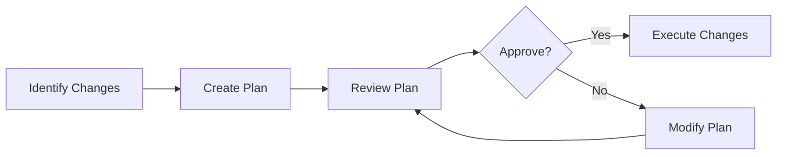
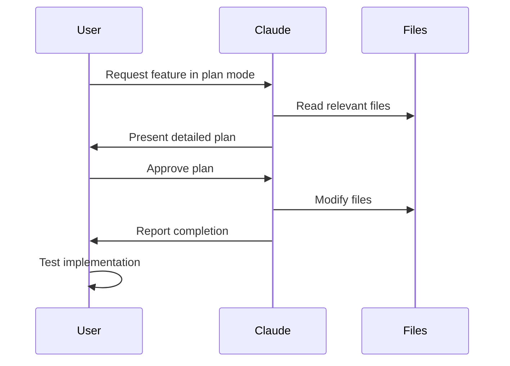
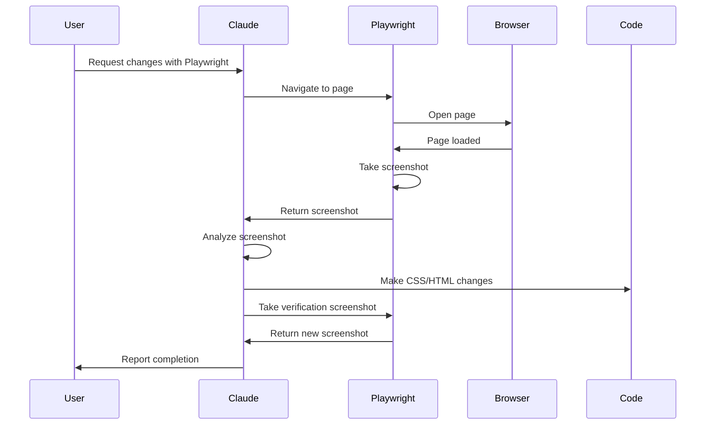
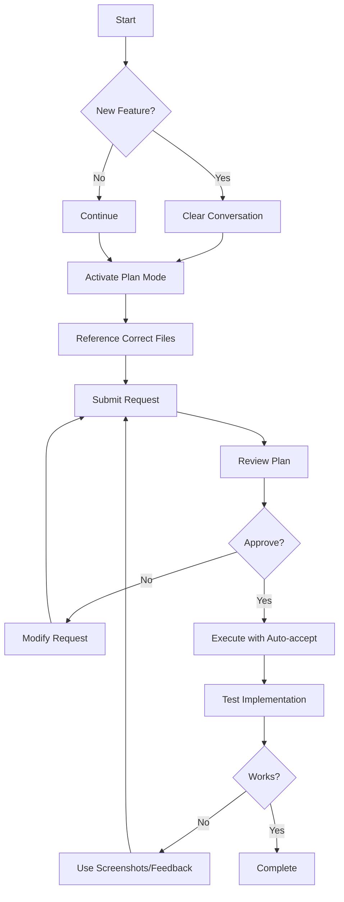

# 4. Adding Features in Claude Code

## Best Practices for Working with Claude Code

### 1. Reference the Correct Files

Claude Code is only as good as the context you provide. When asking for changes:

- **Identify the right files to modify upfront**
- **Use the `@` symbol to reference files/folders**

```bash
# Reference a file
@filename.py

# Reference files in a folder
@folder/

# Use tab completion for full file names
@src/components/ChatInterface[TAB]
```

**Key Principle**: Giving Claude Code the correct context immediately makes the tool much more efficient.

---

### 2. Use Plan Mode for Larger Changes

Instead of having Claude immediately write code, follow this pattern:



#### Activating Plan Mode

- **Keyboard shortcut**: Press `Shift + Tab` twice
- **Indicator**: You'll see "Plan mode is on"

#### Benefits

- Claude creates a detailed plan before making changes
- You can approve or request modifications
- Prevents confusion on complex multi-file changes
- Allows for better strategic thinking

---

## Implementing Source Citations Feature

### Step 1: Start with Plan Mode

```bash
# Activate plan mode
Shift + Tab (twice)

# Reference relevant files and request feature
@frontend/app.py @backend/rag_engine.py
Add source citations to chat responses that show which documents were used
```

### Step 2: Review the Plan

Claude will:

1. Read through necessary files
2. Trace from frontend to backend
3. Create a comprehensive implementation plan

### Step 3: Approve and Execute

Three options when reviewing the plan:

- **Accept**: Proceed with the plan
- **Auto-accept edits**: Don't ask for permission on each change
- **Change plan**: Provide feedback for modifications

**Tip**: To enable auto-accept separately, press `Shift + Tab` once.

### Workflow Overview



---

## Visual Debugging with Screenshots

### The Problem

After implementing source citations in the RAG chatbot, the document source links were functional but hard to read due to styling issues in the Gradio interface.

### Solution: Screenshot-Based Feedback

#### Process

1. **Capture the issue**: Take a screenshot of the problematic UI
2. **Paste into Claude Code**: Simply paste the image
3. **Describe the problem**: "These links are hard to read. Can you make this more visually appealing?"

#### Example

```bash
# User pastes screenshot
[Screenshot showing blue links on interface]

User: "These links are hard to read. Can you make this more visually appealing?"

Claude: "I can see the issue. The links are using a default blue color.
Let me go ahead and make a change."
```

### Benefits of Visual Debugging

| Benefit | Description |
|---------|-------------|
| **Speed** | Faster than describing visual issues |
| **Accuracy** | Claude sees exactly what you see |
| **Iteration** | Quick back-and-forth for refinements |
| **Context** | Better understanding of design needs |

**Key Insight**: Screenshot-based debugging is one of the most commonly used and valuable features for building things quickly.

---

## Adding New Chat Button Feature

### Starting Fresh

When building a new feature, consider clearing conversation history:

```bash
# Clear conversation history
# This provides:
# - Longer context window
# - Avoids confusion from irrelevant previous context
# - Clean slate for new feature
```

### Feature Requirements

Add a "New Session" button that:

- Clears the conversation in the chat window
- Starts a new session with a fresh session_id
- Handles necessary cleanup
- Doesn't require page refresh

### Implementation Steps

#### 1. Activate Plan Mode

```bash
Shift + Tab (twice)
```

#### 2. Submit Request

```bash
Add a new session button. When clicked, it should:
- Clear the conversation in the chat window
- Reset the session_id to None
- Clear the chatbot history in the UI
```

**Tip**: Use `\` + `Enter` to add new lines for better visual organization of your prompt.

#### 3. Review Plan

Claude will identify:

- Frontend changes in `app.py` (Gradio UI)
- Backend session handling in `rag_engine.py`
- State management for `session_id` variable

#### 4. Execute Plan

Monitor the to-do list and file updates. With auto-accept enabled, changes proceed automatically.

---

## Managing Server Execution

### The Issue

Claude Code may attempt to run the server using `./start.sh` when you already have it running.

### Solutions

#### Quick Fix

```bash
User: "Don't run the server. It's already running."
```

#### Persistent Configuration

Add to project memory file:

```markdown
# In CLAUDE.md or CLAUDE.local.md

## Development Preferences

Don't run the server using ./start.sh - I will start it myself.
The application uses a two-server architecture (FastAPI backend on 8000, Gradio frontend on 7860).
```

### Choosing the Right Memory File

| File | Use Case |
|------|----------|
| **CLAUDE.md** | Team-wide preferences (committed to git) |
| **CLAUDE.local.md** | Personal preferences (git-ignored) |

**Example**: If you prefer to manually start the server but other developers don't, use `CLAUDE.local.md`.

---

## MCP Server Integration

### What is MCP?

**MCP (Model Context Protocol)** allows tools like Claude Code to gain additional functionality through external data sources and systems.

### Installing Playwright MCP Server

Playwright enables:

- Opening browsers programmatically
- Taking screenshots automatically
- Analyzing screenshots
- Performing automated testing

#### Installation Command

```bash
# Quit Claude Code first
# Then run:
claude mcp add playwright npx @playwright/mcp@latest
```

#### Verification

```bash
# In Claude Code, use:
/mcp

# You should see:
# ✓ Connected to Playwright MCP server
# Available tools:
# - playwright_navigate
# - playwright_screenshot
# - playwright_click
# - playwright_fill
# - playwright_evaluate
# - etc.
```

### Available Playwright Tools

```markdown
- **playwright_navigate**: Navigate to URLs
- **playwright_screenshot**: Capture page screenshots
- **playwright_click**: Click elements
- **playwright_fill**: Fill form fields
- **playwright_evaluate**: Execute JavaScript
- **playwright_click**: Press keyboard keys
- **playwright_go_back**: Navigate browser history
```

---

## Using Playwright for Automated Visual Testing

### The Workflow

Instead of manually taking screenshots, Claude Code can:

1. Navigate to your page programmatically
2. Take screenshots automatically
3. Analyze the UI
4. Make necessary changes
5. Verify changes with another screenshot

### Example Usage

```bash
User: "Using the Playwright MCP server, visit http://localhost:7860
and view the new session button. I want that button to look the same
as the other buttons in the Session Management section. Make sure
the styling is consistent with the Upload & Process button."
```

#### What Happens



### Tool Permission Management

First time using MCP tools:

```bash
Claude: "I need permission to use these tools:"
- playwright_navigate
- playwright_screenshot

Options:
1. Approve once
2. Always approve for this tool
3. Deny
```

**Recommendation**: Select "Always approve" for trusted MCP servers.

---

## Backend Feature Implementation

### The Goal

Add a new feature that allows users to:

- View conversation history across sessions
- Load previous chat sessions
- Delete old sessions
- Persist session data to disk

### Current State

The existing `rag_engine.py` contains:

- In-memory session storage
- Basic session history management
- Session-based conversation context

### New Requirement

Implement persistent session storage using the `SessionManager` class to save and load conversations from disk.

### Implementation Process

#### 1. Review Current Architecture

```python
# Current rag_engine.py structure
class RAGEngine:
    def __init__(self):
        self.session_history = {}  # In-memory storage

    def generate_response(self, query, session_id):
        """Generate response with session context"""
        # Returns: response text, sources
        pass
```

#### 2. Create Plan

```bash
# In plan mode
@backend/rag_engine.py @backend/session_manager.py

I need to add persistent session storage so users can save their
conversations, list all saved sessions, load previous sessions,
and delete old sessions.
```

#### 3. Expected Changes

Claude will plan to:

- Create `SessionManager` class in `session_manager.py`
- Add file-based persistence for sessions
- Update `rag_engine.py` to use SessionManager
- Add API endpoints in `main.py` for session CRUD operations
- Update frontend `app.py` with session management UI

### File Modifications

```python
# New SessionManager in session_manager.py
class SessionManager:
    """
    Manage persistent session storage

    Methods:
        save_session(session_id, messages): Save session to disk
        load_session(session_id): Load session from disk
        list_sessions(): List all saved sessions
        delete_session(session_id): Delete a session
        clear_all_sessions(): Clear all sessions
    """
    pass
```

### API Endpoints Update

New endpoints will be added to `backend/main.py`:

- `GET /sessions` - List all sessions
- `GET /sessions/{session_id}` - Get specific session
- `DELETE /sessions/{session_id}` - Delete a session

### Testing

After implementation:

```bash
User: "List my saved sessions"

Expected Response:
💬 Saved Sessions:
1. [5 msgs] What is machine learning?
2. [8 msgs] Explain neural networks...
3. [3 msgs] How does RAG work?

# Then load a session
User: "Load session 1"
✅ Loaded session with 5 messages
[Chat history restored in UI]
```

---

## Key Takeaways

### Development Workflow Summary



### Best Practices Checklist

- [ ] Reference correct files using `@` syntax
- [ ] Use Plan Mode for complex changes (Shift+Tab twice)
- [ ] Clear conversation history for new features
- [ ] Enable auto-accept for trusted operations
- [ ] Use screenshots for visual debugging
- [ ] Configure CLAUDE.md for project preferences
- [ ] Install relevant MCP servers for enhanced functionality
- [ ] Test implementations before moving on
- [ ] Press Escape to halt unwanted operations

### Common Commands

| Action | Command |
|--------|---------|
| Activate Plan Mode | `Shift + Tab` (twice) |
| Auto-accept Edits | `Shift + Tab` (once) |
| Reference File | `@filename` |
| New Line in Prompt | `\ + Enter` |
| View MCP Status | `/mcp` |
| Cancel Operation | `Escape` |
